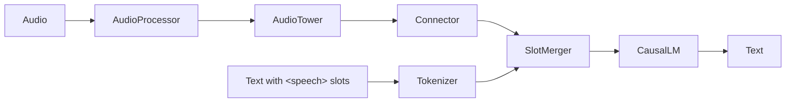

<div align="center">

# Open Audio-LLM

**可组合的 Audio-LLM 后训练与部署框架**

把不同音频编码器接到 Hugging Face CausalLM 上，用同一套 YAML 打通 ms-swift 训练、vLLM 部署与 AmphionEval 评测。

[](pyproject.toml)
[](https://pytorch.org/)
[](https://github.com/huggingface/transformers)
[](https://github.com/modelscope/ms-swift)
[](https://github.com/vllm-project/vllm)
[](https://wandb.ai/1016097967-amphion/open-audio-llm)

[快速开始](#-快速开始) · [文档](docs/README.md) · [模型与结果](#-模型与结果) · [实验归档](#-最新动态)

</div>

---

## 📰 最新动态

- **2026-10-08** — [阶段归档](docs/experiments/2026-10-08/README.md)：8×A800 续训与全参训练、数据质检、180 秒会议评测集，以及与 MOSS-Transcribe-Diarize（官方 vLLM）的同口径对比。迭代流程见 [实验规范](docs/guides/experiments.md#自我迭代流程)。
- **2026-10-06** — [实验结果、训练轨迹与权重归档](docs/experiments/2026-10-06/README.md)：speaker-events、clean/events A/B、统一格式全参训练及 LoRA。
- **checkpoint-34479** — Qwen3-ASR-1.7B 三阶段全参 SFT，同一权重支持普通 ASR、热词偏置和目标说话人 ASR，见 [评测结果](docs/models/ckpt34479-evaluation.md)。

## ✨ 特性

- **组件化模型** — `AudioTower`、`Connector`、`SlotMerger` 与任意支持 `inputs_embeds` 的 Hugging Face CausalLM 自由组合，一条样本可包含多个 `<speech>` 槽位。
- **在线数据** — 直接读取 `audio-data-contract` Catalog，取样时在线增强，不生成离线 ShareGPT；clean 训练版本优先，按 `require_clean_pass: true` 过滤。
- **训练** — 基于 ms-swift 的 SFT / GRPO，支持全参与 LoRA、来源混合、时长/槽位动态 batch 和分布式断点恢复。
- **单机与集群** — 同一份训练 YAML 加上 `cluster` 段即提交到 SenseCore ACP 多机多卡。
- **vLLM 部署** — 通过 `vllm.general_plugins` 注册插件：TS-ASR 可学习 `[SEP]`、全局音频注意力、外部 audio embedding bypass；Compose 与 Kubernetes 部署。
- **解耦评测** — 评测由独立的 [AmphionEval](docs/guides/evaluation.md) 通过 HTTP 服务完成，评测环境不加载模型权重。
- **可追溯实验** — 配置是参数唯一来源；每次执行保存生效配置、状态、日志，W&B 远端核验与对象存储同步。

## 🏗️ 架构



| 组件 | 职责 |
| --- | --- |
| `AudioTower` | 把音频特征转成 `(B, T, D)` hidden states |
| `Connector` | 把音频 hidden size 映射到 LLM hidden size |
| `SlotMerger` | 把一个或多个 `<speech>` 槽位替换为连续音频 embedding |
| `CausalLM` | 任意支持 `inputs_embeds` 的 Hugging Face causal language model |

组件契约见 [架构](docs/reference/architecture.md)。

## 🧩 支持矩阵

| 维度 | 默认支持 | 可选 / legacy |
| --- | --- | --- |
| 音频编码器 | Qwen3-ASR、Qwen3-Omni | Whisper、WavLM（扩展点）；Zipformer（仅 legacy 转换） |
| Connector | `mlp_downsample`、`qformer`、`mean_pool` | — |
| LLM | `AutoModelForCausalLM`（需支持 `inputs_embeds`） | 其他 LM 需 adapter |
| 训练 | ms-swift SFT / GRPO，全参 / LoRA，DeepSpeed | — |
| 推理 | vLLM 0.17（评测）/ 0.18（serving） | HF `generate` |
| 任务 | ASR、热词偏置 ASR、目标说话人 ASR、多说话人 SOT 日志转写 | — |

完整说明见 [兼容矩阵](docs/reference/compatibility-matrix.md)。默认路径不依赖 `k2`。

## 🚀 快速开始

### 安装

在仓库根目录安装即可，所有插件和脚本都在根项目里：

```bash
git clone https://github.com/amphionspace/open-audio-llm.git
cd open-audio-llm

# 训练 / 数据 / 开发
pip install -e ".[hf,swift,data,dev]"

# vLLM 推理（必须带 constraints，固定 CUDA 12.8 的 PyTorch）
pip install -e ".[vllm]" -c constraints/vllm-cu128.txt
```

> [!IMPORTANT]
> 不要在空环境里安装未约束的最新版 vLLM，它可能解析到与驱动不匹配的 CUDA 版本。环境校验标准、serving 镜像和评测环境见 [安装指南](docs/get-started/installation.md)。

### 运行

先在 YAML 中填写模型、解释器、GPU、端口与数据路径（相对路径以配置文件所在目录为基准），用 `--dry-run` 预览后再启动：

```bash
open-audio-llm train --config examples/configs/train/sft.yaml --dry-run
open-audio-llm train --config examples/configs/train/sft.yaml
```

## 🧰 命令一览

所有任务只接受配置路径、任务选择、恢复和预览，不使用业务环境变量或 CLI 参数覆盖。

| 命令 | 示例配置 | 说明 |
| --- | --- | --- |
| `train` | [train/sft.yaml](examples/configs/train/sft.yaml)、[train/grpo.yaml](examples/configs/train/grpo.yaml)、[train/sft-acp.yaml](examples/configs/train/sft-acp.yaml) | SFT / GRPO；带 `cluster` 段时提交到 ACP |
| `rollout` | [rollout/vllm.yaml](examples/configs/rollout/vllm.yaml) | GRPO 的 vLLM rollout 服务 |
| `serve` | [serve/vllm.yaml](examples/configs/serve/vllm.yaml)、[serve/tsasr.yaml](examples/configs/serve/tsasr.yaml) | vLLM 推理服务 |
| `eval` | [eval/comparison.yaml](examples/configs/eval/comparison.yaml) | 调用 AmphionEval 评测 |
| `model` | [model/merge-lora.yaml](examples/configs/model/merge-lora.yaml) | LoRA 合并、legacy checkpoint 转换 |
| `prepare` / `synthesize` | [prepare/](examples/configs/prepare)、[synthesize/sot.yaml](examples/configs/synthesize/sot.yaml) | 数据准备与多说话人合成 |
| `deploy` | [deploy/vllm.yaml](examples/configs/deploy/vllm.yaml) | 生成并执行 Compose 部署 |
| `experiment run` | `runs/<实验>/experiment.yaml` | 按任务编排一次完整实验 |
| `storage sync` | 任务 YAML + `--attempt` | 补传执行记录到对象存储 |

全部配置说明见 [examples/configs](examples/configs/README.md)。

## 📊 模型与结果

**checkpoint-34479**（Qwen3-ASR-1.7B 三阶段全参 SFT，vLLM 0.18 贪心解码）：

| 能力 | 结果 |
| --- | --- |
| 普通 ASR（16 个中英测试集，174,489 条） | 加权 WER/CER **5.64%**，AISHELL-1 CER 0.63%，LibriSpeech test-clean WER 1.66% |
| 热词偏置 ASR（Common Voice，K=50） | 中文 CER 4.32% → **1.72%**，英文 WER 7.83% → **5.06%** |
| 目标说话人 ASR | 注册 3 秒 + 混合音频，`[SEP]` 分隔，见完整报告 |

详见 [评测结果](docs/models/ckpt34479-evaluation.md) 与 [三阶段 SFT 配置](docs/models/qwen3-asr-three-stage-sft.md)。

## 📚 文档

| 类别 | 内容 |
| --- | --- |
| 🟢 [上手](docs/get-started/installation.md) | 安装与环境校验 |
| 📘 [指南](docs/README.md#指南) | [训练](docs/guides/training.md) · [在线数据](docs/guides/online-training-data.md) · [ACP 多机](docs/guides/acp.md) · [评测](docs/guides/evaluation.md) · [部署](docs/guides/deployment.md) · [实验规范](docs/guides/experiments.md) |
| 📐 [参考](docs/README.md#参考) | [架构](docs/reference/architecture.md) · [数据边界](docs/reference/data-boundary.md) · [兼容矩阵](docs/reference/compatibility-matrix.md) · [当前限制](docs/reference/limitations.md) |
| 🎯 [模型](docs/README.md#模型) | 已产出权重的训练配置与评测结果 |
| 🗂️ [实验归档](docs/README.md#实验归档) | 按阶段归档的结论、指标与证据 |

完整索引见 [docs/README.md](docs/README.md)。

## 📁 项目结构

```text
open-audio-llm/
├── src/open_audio_llm/      # 唯一 Python package
│   ├── audio/  connectors/  #   AudioTower 与 Connector 实现
│   ├── data/                #   Catalog 在线数据、采样与增强
│   ├── integrations/        #   ms-swift / vLLM 等集成（唯一位置）
│   └── tsasr/               #   TS-ASR 的 [SEP]、全局音频注意力与 vLLM 后端
├── examples/
│   ├── configs/             # 所有任务的 YAML 配置
│   └── train/ model/ serve/ eval/   # 薄启动入口
├── runs/                    # 实验目录（README、experiment.yaml、tasks/…）
├── docs/                    # 文档，见 docs/README.md
├── constraints/             # vLLM 固定版本约束
├── docker/  deploy/k8s/     # 镜像与 Kubernetes 清单
└── scripts/                 # 实验迁移、上传与部署校验工具
```

<details>
<summary><b>📏 项目约定</b></summary>

- **配置是唯一来源**：shell 文件是薄入口，不接受 `MODEL`、`MAX_STEPS`、`OUTPUT_DIR` 等业务环境变量；数据加载器只从 YAML 读取 Catalog、roots 和缓存路径。
- **实验必须可追溯**：训练和评测同步 W&B，并核验远端 run URL 和实际指标；执行记录保存在 `attempts/<编号>/`，完成状态与质量结论分开记录。凭据留在环境中。
- **部署栈即评测栈**：要部署的 checkpoint 用 vLLM（LoRA 合并后）推理和对比；第三方基线用官方推荐方式；不会自动回退后端。
- **数据**：适用的 clean 训练版本优先并设置 `require_clean_pass: true`；没有 clean 版本时允许原训练集。固定数据版本与真实开发/测试标签，不为通过门槛删难例。
- **边界**：评测数据、请求与打分在 AmphionEval；顶层不再保留 `src/integrations/`，旧 AmphionASR 能力已合并到 `src/open_audio_llm/integrations/` 和 `examples/`。

规范全文见 [实验目录与配置](docs/guides/experiments.md) 和 [AGENTS.md](AGENTS.md)。

</details>

## 🙏 致谢

本项目构建于以下开源工作之上：[ms-swift](https://github.com/modelscope/ms-swift)、[vLLM](https://github.com/vllm-project/vllm)、[Hugging Face Transformers](https://github.com/huggingface/transformers)、[Qwen3-ASR](https://github.com/QwenLM)、[DeepSpeed](https://github.com/deepspeedai/DeepSpeed)、[Weights & Biases](https://wandb.ai/)。
