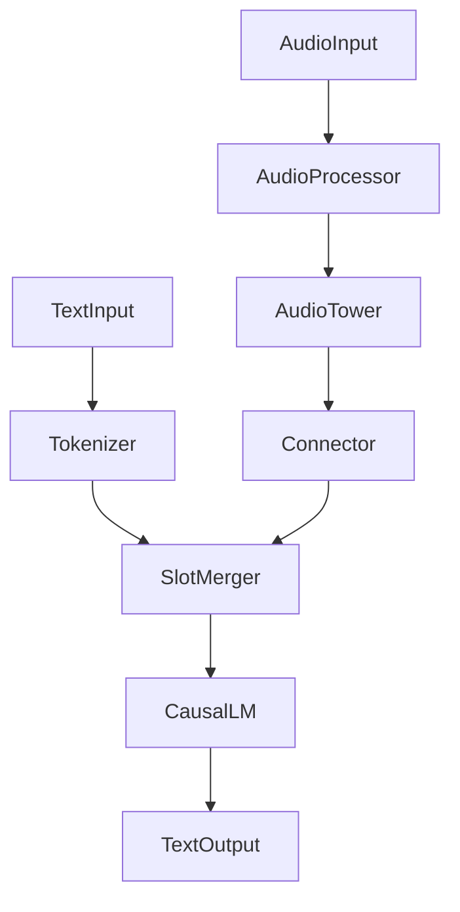

# Architecture

The project treats Audio-LLM training as component composition rather than a
single fixed ASR architecture.

## Component Contracts

- `AudioTower.forward(features, lengths)` returns `(hidden, hidden_lengths)`.
- `AudioTower.get_output_lengths(input_lengths)` must be deterministic so vLLM
  can reserve prompt-replacement space.
- `Connector.forward(hidden, hidden_lengths)` returns LLM-width embeddings and
  updated lengths after any temporal downsampling.
- `SlotMerger` replaces each `<speech>` placeholder with the corresponding
  audio embedding sequence. Multi-audio prompts are first-class.
- `CausalLM` is loaded through `AutoModelForCausalLM` and receives
  `inputs_embeds`.

## Extension Rule

Adding a new audio encoder should require a new `AudioTower` adapter and config
entry only. It should not require editing the core model forward path.
