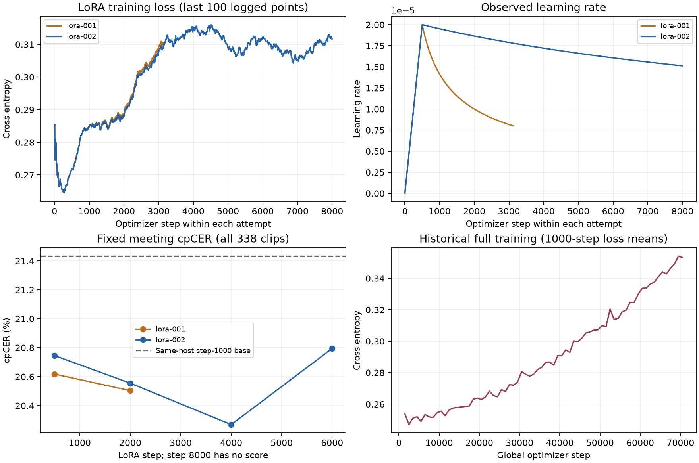

# 2026-10-06 实验结果、轨迹与权重归档

截至 2026-10-06，最新完整权重是统一格式训练的 **LoRA 执行 002 / checkpoint-8000**；该点的评测未启动成功，不能认定质量达标。最近完成评测的是 6000 步，cpCER 为 **20.79%**；同一条轨迹已评测点中，4000 步的 **20.27%** 数值最低，同机基座为 21.43%。这里的“数值最低”不代表在独立测试集上选出的最佳模型。

本次整理已有产物，没有启动训练或重新推理。最新训练产物结束于 **2026-10-05 08:52 UTC**，归档时本机未发现训练进程。Git 保存报告、指标快照、完整已记录的训练指标 CSV、配置和证据索引；对象存储保存原始运行记录及 9 组权重。完整清单见 [结果数据](results.json)、[原始产物清单](artifact-manifest.json)和[权重清单](weights.json)。上阶段背景见 [9 月 22–29 日记录](../2026-09-22-to-29.md)。

## 当前状态

| 实验 / 执行 | 实际进度 | 结果及限制 |
| --- | --- | --- |
| speaker-events | 最后日志 21,155 步；最新完整权重 21,000 步 | 固定集 cpCER 22.84%，7000 步为 21.57%；差异未达显著，不能认定继续训练有收益 |
| clean/events A/B | control、treatment 各完成 1000 步 | 固定集评测失败，没有两组最终优劣结论 |
| 统一格式先导 / train 003 | 1000 步训练完成，训练子进程退出码 0 | 记录器结束核验未完成，执行总退出码 1；后续固定集评测完成 |
| 全量全参 / full-training 001 | 日志止于 71,225；完整权重 71,000 | 已停止，同机固定集明显退化；旧 `status.json` 的 `running` 未收尾，保留原文 |
| LoRA / local-training 001 | 日志止于 3,135；完整权重 3000 | 因实际调度器忽略 `timescale=10000` 停止，退出码 143；500、2000 步评测完成 |
| LoRA / local-training 002 | 完整权重 8000；退出码 1 | 500、2000、4000、6000 步评测完成；8000 步 W&B 启动核验超时，评测失败传递后训练停止 |

8000 步失败发生在评测启动阶段，日志为 W&B API 服务超时；没有该点模型输出或评分。不能把这次基础设施失败写成模型质量退化，也不能用 6000 步成绩代表 8000 步。原始失败状态、日志和已完成结果均保留在归档中。

## 最新 LoRA 的数据与训练契约

从统一格式 `train/003/checkpoint-1000` 重新初始化，两次 LoRA 执行各自使用新优化器、调度器和数据游标；没有从退化的 71000 步权重续训。002 也没有继承 001 的错误调度状态。

| 项目 | 实际配置 / 核验证据 |
| --- | --- |
| 基础模型 | Qwen3-ASR-1.7B 衍生的统一格式 checkpoint-1000 |
| 数据覆盖 | 固定 75 个来源，4,023,765 条有效记录；无固定数量子集 |
| 样本配比 | 单人回放 20%、多人合成 40%、真实会议 40%；单人合成计入回放 |
| 完整覆盖计划 | 13,500,000 次读取；覆盖核验通过不等于训练已走完一轮 |
| 重复读取 | 真实会议平均约 137 次/覆盖轮，不算新增数据 |
| Clean 边界 | 有适用 clean 版本的来源沿用实际通过标记；不能声称全量都通过相同强度的声学清洗 |
| 更新范围 | LoRA rank 32 / alpha 64，语言模型线性层；34,865,152 个可训练参数，音频编码器、对齐器和基座冻结 |
| Loss | 按样本平均的 CE；`replay_kl_weight=0`，不加载教师，不能宣称 KL 提供保持约束 |
| 机器与 batch | 2 × RTX 5090 32GB；每卡 1 条，累积 16，通常每更新 32 条 |
| 学习率 | 峰值 2e-5，warmup 500 步，inverse-sqrt，002 的 timescale 为 10000 |
| 训练期限 | 无业务步数或 epoch 上限；因上述失败停止，不能称为计划训练完成 |
| 保存与评测 | 每 500 步保存；首个 500 步及之后每 2000 步暂停更新进行 vLLM 评测 |

[数据覆盖核验][coverage]、[实际 loss/可训练参数][objective]、[原始训练配置][train-config]。配置保留当时的绝对路径和运行参数，属于历史快照；在其他机器复现时需恢复依赖、数据版本及路径，不能直接视为当前主分支的可运行配置。归档包含实际实验脚本，但没有完整、可信的逐次训练源码 commit 记录，故不推断每次训练对应的精确仓库版本。

## 固定集结果

固定会议集包含 338 条、28 场会议：AISHELL-4 200 条、AliMeeting 138 条，共 5.5391 小时。清单 SHA256：

```text
5d894eae0c41cf3c4c9929b4165b1a879aa5e67f6e3210b7ade24f52fdac7227
```

统一使用同机 vLLM 0.18.0、RTX 5090、BF16、TRITON_ATTN，temperature 0、seed 42、4096-token 输出上限，完整音频 attention（`n_window_infer=13400`）。LoRA 在 CPU 合并后加载。配置与实际引擎证据见 [4000 步 runtime][runtime]。基线使用本机重新生成的 1000 步结果，不混用此前其他 GPU/内核上的 20.94%。

cpCER 按说话人匹配后计算字符错误率，两个数据集等权平均；主 cpCER 保留全部 338 条，包括触顶和异常格式。tcpCER 额外约束时间对应，表内采用双方共同可解析样本；不同覆盖数不能直接横比。错误率越低越好。

| 执行 / checkpoint | cpCER，338 条 | tcpCER 5s | 时间评分对数 | 触顶条数 |
| --- | ---: | ---: | ---: | ---: |
| 同机统一格式基座 1000 | 21.43% | 21.57% | 337 | 2 |
| 历史全参 71000 | 29.34% | 31.01% | 337 | 25 |
| LoRA 001 / 500 | 20.62% | 20.85% | 337 | 0 |
| LoRA 001 / 2000 | 20.50% | 20.83% | 337 | 0 |
| LoRA 002 / 500 | 20.75% | 21.05% | 337 | 0 |
| LoRA 002 / 2000 | 20.55% | 20.60% | 336 | 1 |
| LoRA 002 / 4000 | **20.27%** | **20.55%** | 337 | 0 |
| LoRA 002 / 6000 | 20.79% | 21.13% | 337 | 0 |
| LoRA 002 / 8000 | 未评测 | 未评测 | 0 | 未知 |

002 的 2000 步比较只有 336 对时间评分，其基线 tcpCER 5s 为 **21.38%**，不是第一行 337 对的 21.57%。W&B `metrics.json` 中直接按候选汇总的 tcpCER 可能使用不同可解析样本，本表明确采用 `summary.json` 中的配对统计。

002 / 4000 相对基座 cpCER 降低 **1.16 个百分点**，会议级 bootstrap 95% 区间为 **[-1.91, -0.38]**，双侧置换检验 p=0.0235；6000 步降低 0.64 个百分点，区间 **[-1.96, +1.10]**、p=0.4674。这些是各次比较的原始统计，**未做反复 checkpoint 比较的多重校正**；没有独立测试集选择验证，也没有据此证明 4000 显著优于 6000。

[4000 步完整结果][eval4000]、[6000 步完整结果][eval6000]、[71000 步同机对照][eval71000]。

### ASR 回访

AISHELL、KeSpeech、LibriSpeech 各 16 条固定开发样本，共 48 条；每条分别使用空提示 / 单人 Diarization 提示。这里只作小规模回归检查，不作为完整测试集能力结论。

| 模型 | AISHELL CER（空 / Diarization） | KeSpeech CER（空 / Diarization） | LibriSpeech WER（空 / Diarization） |
| --- | ---: | ---: | ---: |
| 同机基座 1000 | 0.39% / 0.39% | 10.66% / 10.66% | 2.82% / 2.82% |
| LoRA 002 / 4000 | 0.39% / 0.39% | 9.84% / 10.25% | 2.25% / 2.25% |
| LoRA 002 / 6000 | 0.39% / 0.39% | 10.25% / 11.48% | 2.54% / 2.82% |

### 历史退化的已确认问题

71000 步相对基座 cpCER 增加 7.91 个百分点（95% 区间 +4.95 至 +10.46），且触顶从 2 条增至 25 条。原诊断确认：全量阶段取消任务配比后真实会议更新占比大幅降低；统一格式样本没有命中原 KL 分支；长期恒定学习率全参更新且缺少周期固定集监测。不能仅用训练 loss 噪声解释退化，也没有受控证据分摊这些因素的因果贡献。

Qwen 官方输出解析会压缩长重复后再计分；主 cpCER 是同口径后处理后的结果，原始文本和 token IDs 则用于观察重复循环。格式合规率提高不能替代识别能力。[原始诊断数据][diagnosis]与完整中文诊断报告均归档；本次没有为这些问题重跑实验。

## 训练轨迹与 W&B



[轨迹索引](trajectories/index.json)记录每个 CSV 对应的原日志路径、SHA256、记录行数及最后一步。CSV 保留每个日志点的 loss、`ce_sot`、学习率、梯度范数和 epoch；其他字段（如 `ce_asr`、`replay_kl`）保存在归档的原始 JSONL 中，不补造未记录的 step。图中 LoRA loss 使用最近 100 个日志点的均值，全参历史 loss 使用 1000 步区间均值；CSV 和原始 JSONL 保留未平滑值。不同执行的步数和数据分布独立，曲线不拼接成一次连续训练。

- [LoRA 002](https://wandb.ai/1016097967-amphion/open-audio-llm/runs/unified-diarization-local-lora-002)：历史核验记录到 global_step=8000、远端状态 failed。
- [LoRA 001](https://wandb.ai/1016097967-amphion/open-audio-llm/runs/unified-diarization-local-lora-001)：错误调度执行，已停止。
- [4000 步评测](https://wandb.ai/1016097967-amphion/open-audio-llm/runs/unified-diarization-local-lora-eval-step-4000-001)、[6000 步评测](https://wandb.ai/1016097967-amphion/open-audio-llm/runs/unified-diarization-local-lora-eval-step-6000-001)：历史结束核验各记录 190 项指标。

**证据边界：** 001、002 的 500 / 2000 步评测复用了相同 W&B run ID，URL 本身不能区分两次执行。报告与统计依据各自 `attempts/001`、`attempts/002` 下保存的原始输出和 summary。当前归档机器的 `~/.bashrc` 没有 W&B API key，本次远端只读复查未能认证；[复查记录](wandb-remote-verification.json)明确标注此限制，已有历史核验证据原样保留，未伪称本次重新核验通过。

## 权重与原始证据下载

对象存储桶为 `whai`，前缀为 `open-audio-llm`；使用已有 AmphionBucket `ab` 凭据访问，不设置公开 ACL。当前机器内网地址不可达，本次通过同一桶的公网 HTTPS 上传。权重路径与原 `runs/...` 目录对应；每个文件的远端路径、字节数和 SHA256 见 [weights.json](weights.json)。

| 清单 ID | 内容 | 使用边界 |
| --- | --- | --- |
| `lora-002-step8000` | 最新 LoRA adapter、optimizer、scheduler、RNG、采样游标、trainer 状态 | 可作为恢复素材；必须搭配下列基座与相同数据/训练契约，尚无该点评分 |
| `unified-base-step1000` | 完整基础模型与 tokenizer | 8000 步 adapter 的必需基座；不含历史优化器状态 |
| `lora-002-step4000-merged` | 已评测完整合并模型 | 当前轨迹 cpCER 数值最低；仅推理，无该点优化器状态 |
| `lora-002-step6000-merged` | 最近已评测完整合并模型 | 仅推理，无该点优化器状态 |
| `lora-001-step3000` | 历史 LoRA 与恢复状态 | 错误调度轨迹，仅供追溯；不建议继承其调度状态 |
| `full-training-step71000` | 历史完整模型 | 固定集明显退化，不作为推荐模型；无优化器状态 |
| `clean-events-control-step1000` | A/B 对照组完整模型 | 没有最终 A/B 评测结论；无优化器状态 |
| `clean-events-treatment-step1000` | A/B 实验组完整模型 | 没有最终 A/B 评测结论；无优化器状态 |
| `speaker-events-step21000` | 旧 speaker-events 完整模型 | 对应 21000 步历史结果；无优化器状态 |

下载 4000 步合并模型，或最新 8000 步 LoRA 与基座：

```bash
ab pull whai:open-audio-llm/runs/unified-diarization-asr-20261001/tasks/local-training/attempts/002/artifacts/training/retention-evaluations/checkpoint-4000/merged-model/ ./models/lora-002-step4000

ab pull whai:open-audio-llm/runs/unified-diarization-asr-20261001/tasks/local-training/attempts/002/artifacts/training/checkpoint-8000/ ./models/lora-002-step8000
ab pull whai:open-audio-llm/runs/unified-diarization-asr-20261001/tasks/train/attempts/003/artifacts/training/checkpoint-1000/ ./models/unified-base-step1000
```

8000 步是 adapter，不能当作独立完整模型加载。推理前使用 [LoRA 合并配置](../../../examples/configs/model/merge-lora.yaml)，显式指定下载后的基座和 adapter 路径，再使用 vLLM；adapter 配置中的历史绝对基座路径需按本地位置解析。合并模型做上述固定集复现时，也须沿用 runtime 中的完整 attention、提示和解码设置。

原始证据压缩包包含 1,046 个文件：生效配置、任务脚本、状态、训练/性能日志、原始预测、逐条评分、完整报告、数据预检与 W&B 历史核验。它不含数据音频、外部依赖目录或模型权重；符号链接及原目标单独记录在清单中。恢复模型引用时按权重清单下载，不依赖原机器的绝对符号链接。

```bash
ab pull whai:open-audio-llm/publications/2026-10-06/experiment-evidence-20261006.tar.gz ./experiment-evidence-20261006.tar.gz
# 解压到独立目录，保留原来的 runs/... 路径。
mkdir -p ./experiment-evidence-20261006
tar -xzf ./experiment-evidence-20261006.tar.gz -C ./experiment-evidence-20261006
```

校验范围与上传结果见 [storage-verification.json](storage-verification.json)；原始证据包和全部成员的 SHA256 见 [artifact-manifest.json](artifact-manifest.json)。已轮转删除的早期 adapter/优化器没有重建，4000、6000 步保存的是当时实际评测使用的合并模型。归档不改变原始实验状态、配置、固定评测集或本地权重。

[coverage]: evidence/runs/unified-diarization-asr-20261001/tasks/rebalance-data/attempts/001/artifacts/verification.json
[objective]: evidence/runs/unified-diarization-asr-20261001/tasks/local-training/attempts/002/artifacts/training/retention-objective.json
[train-config]: evidence/runs/unified-diarization-asr-20261001/configs/train-local.yaml
[runtime]: evidence/runs/unified-diarization-asr-20261001/tasks/local-training/attempts/002/artifacts/training/retention-evaluations/checkpoint-4000/attempts/001/artifacts/evaluation/latest/runtime.json
[eval4000]: evidence/runs/unified-diarization-asr-20261001/tasks/local-training/attempts/002/artifacts/training/retention-evaluations/checkpoint-4000/attempts/001/artifacts/evaluation/summary.json
[eval6000]: evidence/runs/unified-diarization-asr-20261001/tasks/local-training/attempts/002/artifacts/training/retention-evaluations/checkpoint-6000/attempts/001/artifacts/evaluation/summary.json
[eval71000]: evidence/runs/unified-diarization-asr-20261001/tasks/evaluate-71000/attempts/002/artifacts/evaluation/summary.json
[diagnosis]: evidence/runs/unified-diarization-asr-20261001/shared/diagnostics/regression-71000-20261004/diagnosis.json
